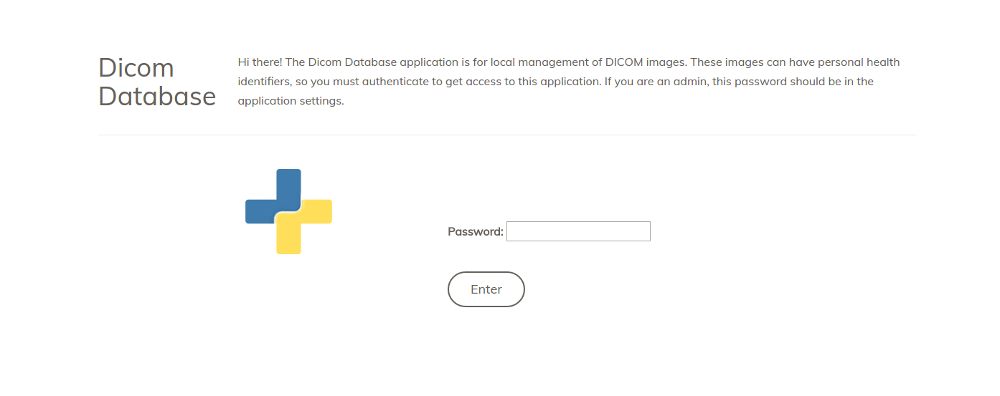

# Dicom Database

**under development**

This is a simple web application for sending and receiving dicom datasets, a simplified version of [sendit](https://www.github.com/pydicom/sendit). It is optimized for the following:
    
   - import of `pydicom/dicom-datasets` (under development?)
   - using pynetdicom3 to send and receive
   - visualization of images

For module and modality specific docs and setup instructions, see our [documentation](https://pydicom.github.io/dicom-database/). If anything is missing documentation please [open an issue](https://www.github.com/pydicom/dicom-database/issues)
