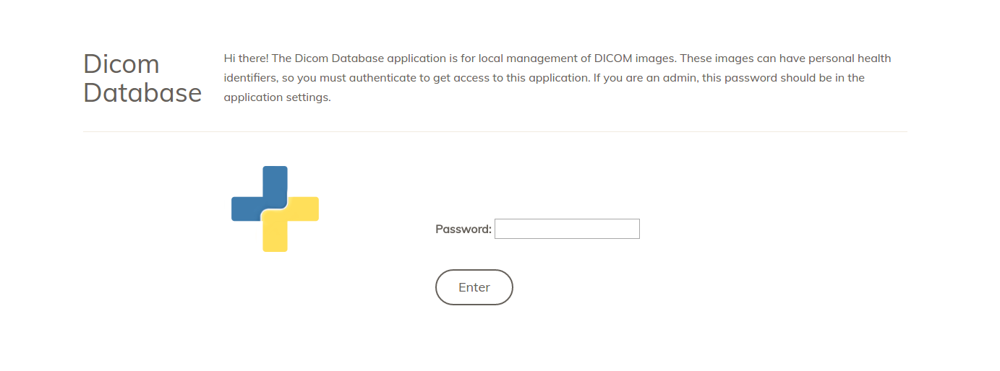
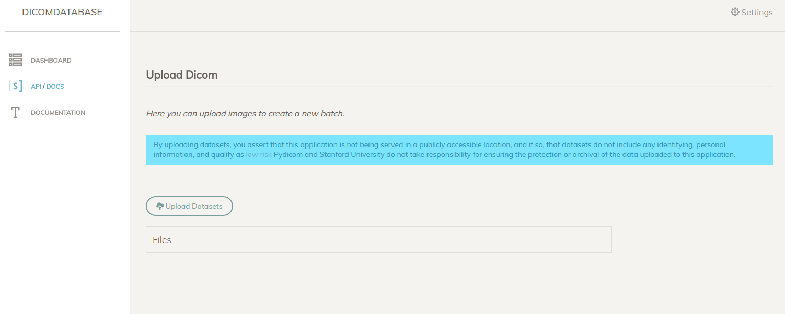
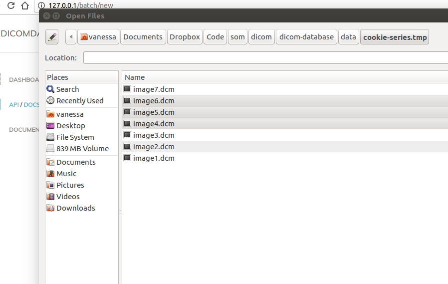
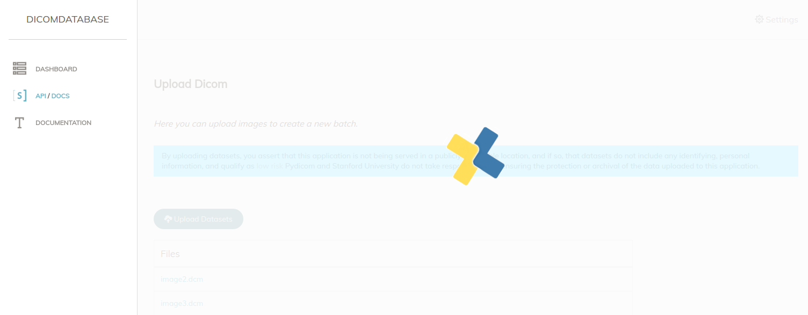
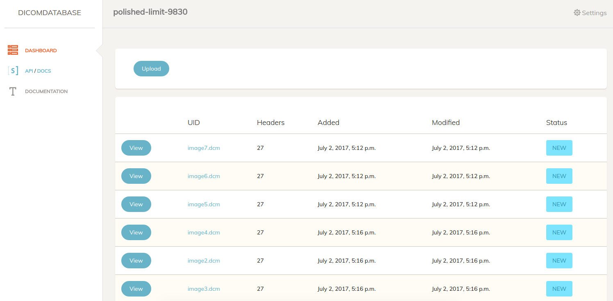
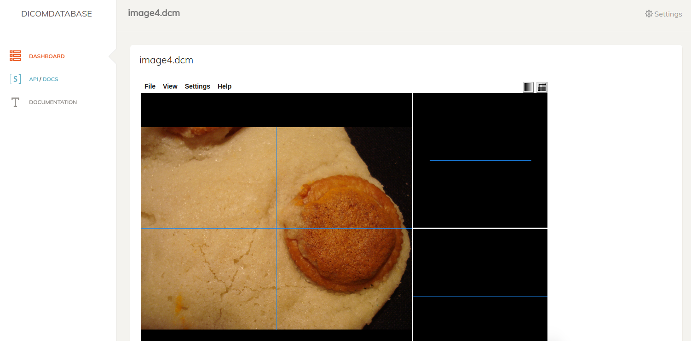
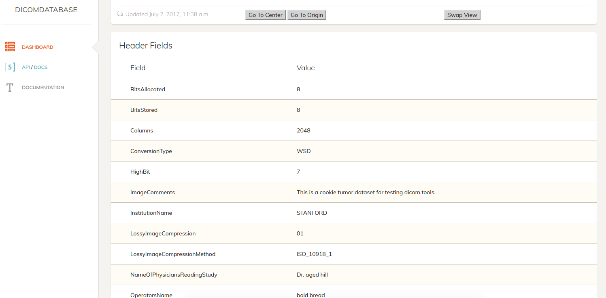

# Interface
This application is intended to be a local application, so the interface is important for monitoring batches, performing searches, and viewing data. This interface can be modified as needed, depending on the needs of the user (the developer or administrator of the server). Views that are not yet developed (that @vsoch will develop):

  - search interface, web: for querying down dicom files based on their field and value
  - search interface, query command line (in web): this will (attempt to be) an interactive console directly in the web browser. Note that this **absolutely** cannot be open to the world because it exposes the application database (there will be a setting to disable it)
  - command line query: akin to the previous, but from a command line

# Lockdown
The main interface is, by default, on lockdown. This password and setting is defined in the [config.py](../dicomdb/settings/config.py), and we recommend that the user does not disable it, to have an extra layer of security. Once your browser is logged in, you won't need to do it for that session.




# Dashboard
For the dashboard and settings views, you will notice the interface "jump" every 10 seconds. This is because it automatically refreshes itself, to show updates if there are any. This is more important if you are using the watcher, as oppose to uploading files in the interface.


## Watcher Status
If you do choose to upload files with the watcher, meaning you have some other programmatic method for dumping folders with dicom images in his watched folder (`data`), then you will care about the watcher's status. The watcher status is determined by the presence of absence of the pid file, and will show you the status in the interface if active:


or inactive:


The watcher is by default shown on the dashboard and in settings, but disabled in batch and image detail views.


## Batches
The dashboard also shows basic info about the batches.  In the picture below, we see the batches table. 


Given that a batch has errors, there will be a link to inspect the specific error message (the error tracking is implemented, but not yet the view).


# Content

## Upload

The first interaction the user is likely to have is uploading content. This is done via the `upload` button in the top left of the dashboard. Given the desire to upload to an already existing batch, the user can find the same button in the batch's main view. When we click from either view, we see the upload interface. 



When the "Upload Datasets" button is clicked, the user can select one or more dicom files for the batch:



The upload itself is done with a separate worker task, so there should be minimal delay in doing the upload itself. The only time should be to get the files uploaded to the browser. If you are quick, you might get a glimpse of the pydicom logo spinning happily!



When the upload finishes, clicking on any of the images will take you to the batch's view

## Batch
Each batch is simply a table of the files, with the option to view details for any of them.





## Image Details
This interface is also relatively simple. The top has an orthogonal viewer:



and the bottom has a table of fields.




# API
It might be desired at some point to have the application be able to talk to others, so it has a simple API to serve batches and images, each as resources. 


## Resources
Per typical rest api, the following returns a paginated result of all resources, with links to `next` and `previous`, along with a `count`, and a list of `results` objects, each corresponding with one model. The api endpoints might look like this:

```
/api/images
/api/batches
/api/headers
```

and there is a general Swagger View at `/api`. Visually, it looks like this:


This means that, to query a specific page you would do:

```
/api/images?page=2
```

and again, this entire interface is behind the lockdown password, and can have additional authentication or changes if needed.


## Swagger
If the user (the administrators of the endpoint) want to interact or query dynamically, a swagger endpoint is provided:


And it generally explains the resources.


