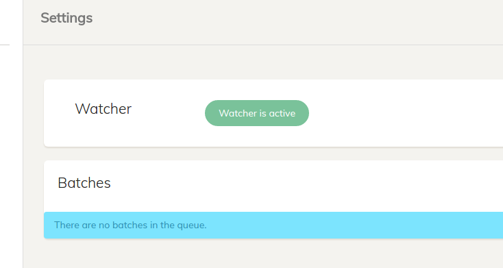
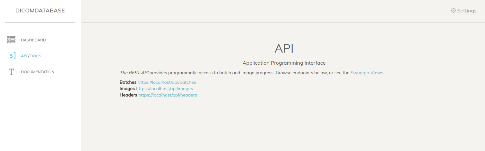
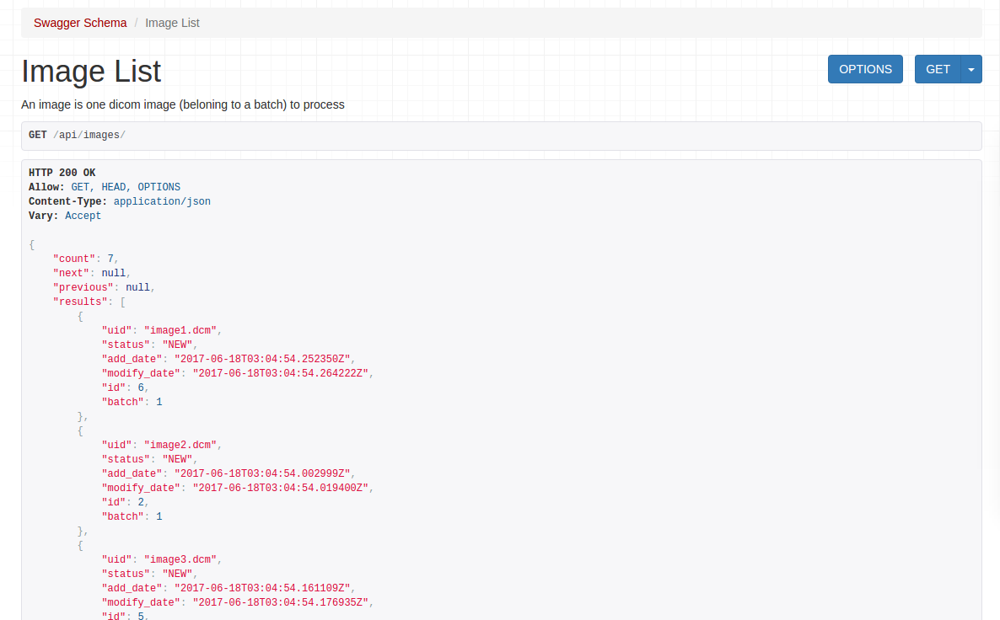
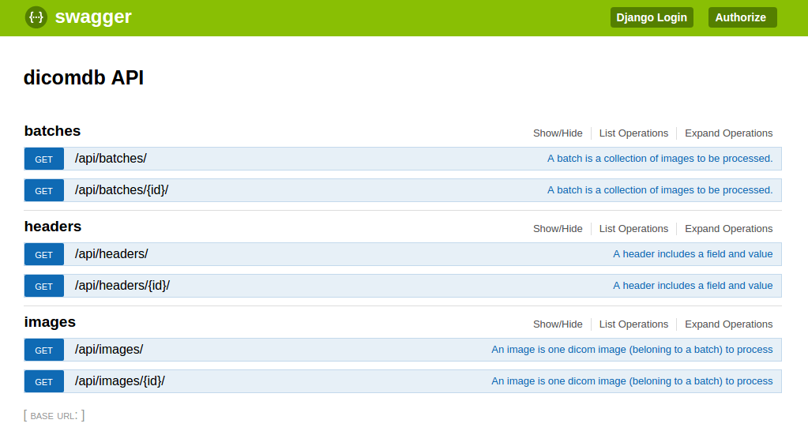
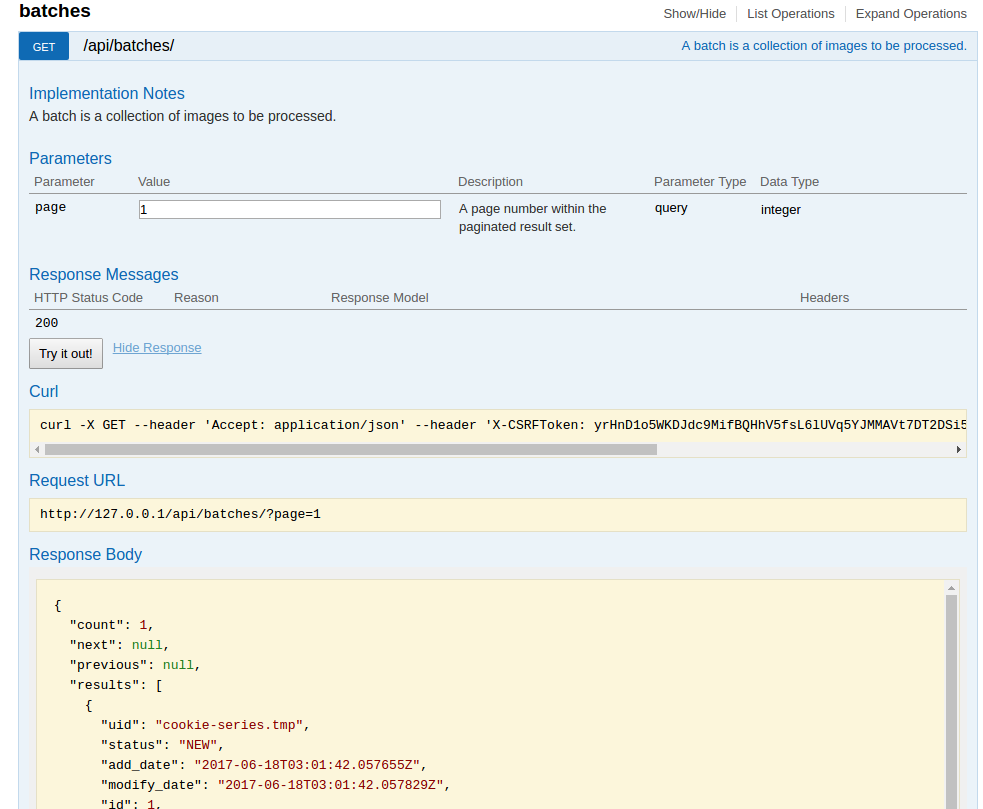

# Interface
This application is intended to be a local application, so the interface is important for monitoring batches, performing searches, and viewing data. This interface can be modified as needed, depending on the needs of the user (the developer or administrator of the server). 

# Dashboard
For the dashboard and settings views, you will notice the interface "jump" every 10 seconds. This is because it automatically refreshes itself, to show updates if there are any.


## Watcher Status
The watcher status is determined by the presence of absence of the pid file, and will show you the status in the interface if active:



or inactive:


## Batches
The dashboard also shows basic info about the batches. In the above pictures, there are none. In the picture below, there is one new batch. 


Given that a batch has errors, there will be a link to inspect the specific error message (the error tracking is implemented, but not yet the view).

Next, learn about usage by reading about the [manager](manager.md).


# API
It might be desired at some point to have the application be able to talk to others, so it has a simple API to serve batches and images, each as resources. 




## Resources
Per typical rest api, the following returns a paginated result of all resources, with links to `next` and `previous`, along with a `count`, and a list of `results` objects, each corresponding with one model. The api endpoints might look like this:

```
/api/images
/api/batches
```

and visually, it looks like this:



This means that, to query a specific page you would do:

```
/api/images?page=2
```

and again, this entire interface is behind the lockdown password, and can have additional authentication or changes if needed.


## Swagger
If the user (the administrators of the endpoint) want to interact or query dynamically, a swagger endpoint is provided:



And it generally explains the resources.



